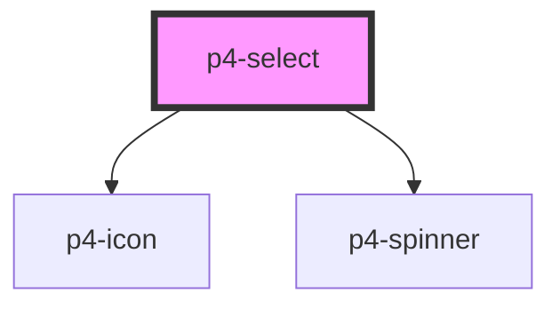

# p4-select

<!-- Auto Generated Below -->

## Properties

| Property        | Attribute        | Description                                                                                            | Type                                | Default                                      |
| --------------- | ---------------- | ------------------------------------------------------------------------------------------------------ | ----------------------------------- | -------------------------------------------- |
| `actions`       | --               |                                                                                                        | `any[]`                             | `[]`                                         |
| `clearInput`    | `clear-input`    | If `true`, a clear icon will appear in the input when there is a value. Clicking it clears the input.  | `boolean`                           | `false`                                      |
| `config`        | `config`         |                                                                                                        | `any`                               | `{ itemValue: 'value', itemLabel: 'label' }` |
| `debounce`      | `debounce`       | Set the amount of time, in milliseconds, to wait to trigger the `onChange` event after each keystroke. | `number`                            | `0`                                          |
| `disabled`      | `disabled`       | If true, the user cannot interact with the button. Defaults to `false`.                                | `boolean`                           | `false`                                      |
| `filterOptions` | `filter-options` |                                                                                                        | `boolean`                           | `true`                                       |
| `name`          | `name`           | The input field name.                                                                                  | `string`                            | `this.inputId`                               |
| `options`       | --               | If true, the user cannot interact with the button. Defaults to `false`.                                | `any[]`                             | `[]`                                         |
| `placeholder`   | `placeholder`    | The input field placeholder.                                                                           | `string`                            | `undefined`                                  |
| `required`      | `required`       | If true, required icon is show. Defaults to `false`.                                                   | `boolean`                           | `false`                                      |
| `showLoader`    | `show-loader`    |                                                                                                        | `boolean`                           | `false`                                      |
| `size`          | `size`           | The button size. Possible values are: `"sm"`, `"md"`, `"lg"`. Defaults to `"md"`.                      | `"lg" \| "md" \| "sm"`              | `'md'`                                       |
| `type`          | `type`           |                                                                                                        | `"menu" \| "select" \| "typeahead"` | `'select'`                                   |
| `value`         | `value`          | The input field value.                                                                                 | `number \| string`                  | `undefined`                                  |
| `variant`       | `variant`        | Button variants Possible values are `"default"`, `"dashed"`. Defaults to `"default"`.                  | `"dashed" \| "default"`             | `'default'`                                  |

## Events

| Event           | Description                                 | Type               |
| --------------- | ------------------------------------------- | ------------------ |
| `p4ActionClick` | Emitted when the action button is clicked.. | `CustomEvent<any>` |
| `p4Blur`        | Emitted when the input loses focus.         | `CustomEvent<any>` |
| `p4Change`      | Emitted when the value has changed..        | `CustomEvent<any>` |
| `p4Focus`       | Emitted when the input has focus.           | `CustomEvent<any>` |
| `p4Input`       | Emitted when a keyboard input occurred.     | `CustomEvent<any>` |

## Methods

### `setBlur() => Promise<void>`

Sets blur on the native `input` in `ion-input`. Use this method instead of the global
`input.blur()`.

#### Returns

Type: `Promise<void>`

### `setFocus() => Promise<void>`

Sets focus on the native `input` in `ion-input`. Use this method instead of the global
`input.focus()`.

#### Returns

Type: `Promise<void>`

## Dependencies

### Depends on

- [p4-icon](../p4-icon)
- [p4-spinner](../p4-spinner)

### Graph

----------------------------------------------

*Built with love!*
