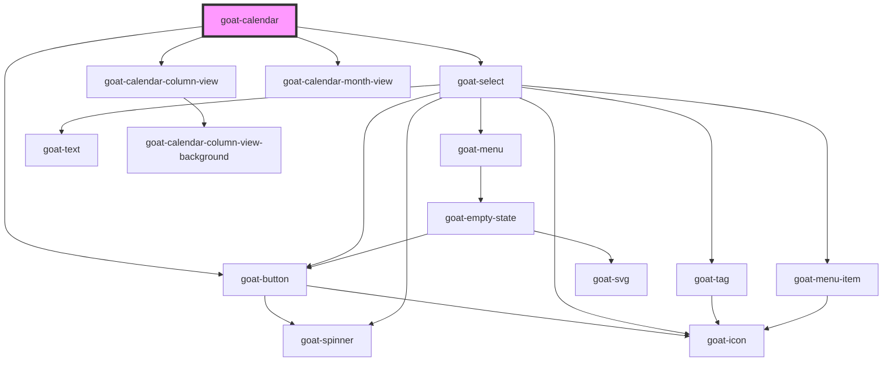

# goat-avatar

<!-- Auto Generated Below -->

## Properties

| Property         | Attribute         | Description      | Type                 | Default                                                                                                                                                                                                                                                                     |
| ---------------- | ----------------- | ---------------- | -------------------- | --------------------------------------------------------------------------------------------------------------------------------------------------------------------------------------------------------------------------------------------------------------------------- |
| `availableViews` | --                | Available views. | `CalendarViewType[]` | `[     {       label: 'Day',       value: 'day',       type: 'column',       days: 1,     },     {       label: 'Week',       value: 'week',       type: 'column',       days: 7,     },     {       label: 'Month',       value: 'month',       type: 'month',     },   ]` |
| `contextDate`    | --                | Context date.    | `Date`               | `undefined`                                                                                                                                                                                                                                                                 |
| `eventClickable` | `event-clickable` | Event clickable. | `boolean`            | `true`                                                                                                                                                                                                                                                                      |
| `events`         | --                | Calendar events. | `EventType[]`        | `[]`                                                                                                                                                                                                                                                                        |
| `showLoader`     | `show-loader`     | Show loader.     | `boolean`            | `false`                                                                                                                                                                                                                                                                     |
| `timezone`       | `timezone`        | Timezone.        | `string`             | `undefined`                                                                                                                                                                                                                                                                 |
| `view`           | `view`            | Calendar view.   | `string`             | `'week'`                                                                                                                                                                                                                                                                    |

## Events

| Event                        | Description           | Type               |
| ---------------------------- | --------------------- | ------------------ |
| `goat-calendar--event-click` | Calendar event click. | `CustomEvent<any>` |

## Dependencies

### Depends on

- [goat-button](../../../button/button)
- [goat-select](../../../input-controls/select)
- [goat-calendar-column-view](column-view)
- [goat-calendar-month-view](month-view)

### Graph

----------------------------------------------

*Built with love!*
