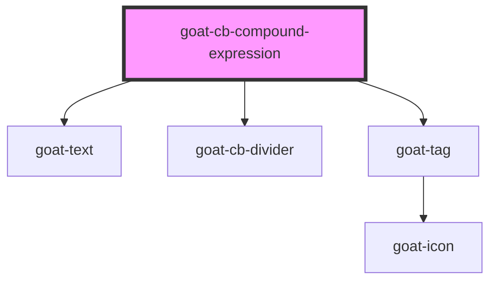

# goat-icon

<!-- Auto Generated Below -->

## Properties

| Property            | Attribute            | Description | Type            | Default     |
| ------------------- | -------------------- | ----------- | --------------- | ----------- |
| `conditionOperator` | `condition-operator` |             | `"and" \| "or"` | `undefined` |
| `fieldLabel`        | `field-label`        |             | `string`        | `''`        |
| `fieldName`         | `field-name`         |             | `string`        | `''`        |

## Dependencies

### Depends on

- [goat-text](../../../primitive/typography/text)
- [goat-cb-divider](../cb-divider)
- [goat-tag](../../../primitive/tag)

### Graph

----------------------------------------------

*Built with love!*
