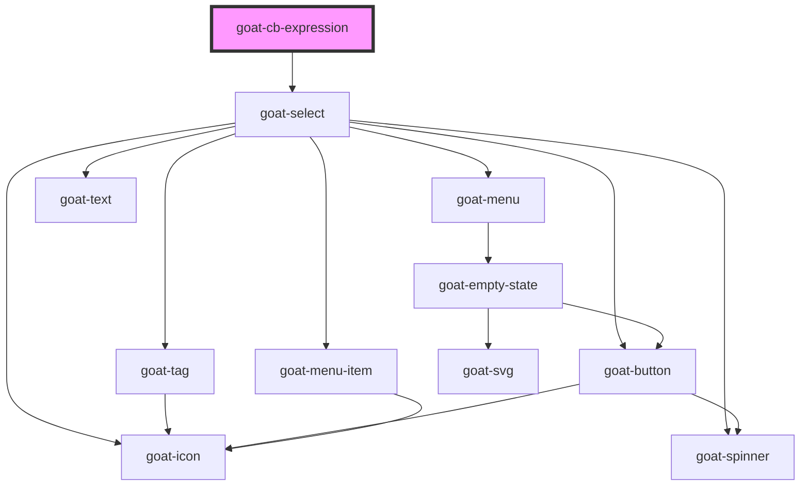

# goat-icon

<!-- Auto Generated Below -->

## Properties

| Property        | Attribute        | Description | Type     | Default |
| --------------- | ---------------- | ----------- | -------- | ------- |
| `operatorValue` | `operator-value` |             | `string` | `''`    |
| `operators`     | --               |             | `any[]`  | `[]`    |

## Dependencies

### Depends on

- [goat-select](../../../input-controls/select)

### Graph

----------------------------------------------

*Built with love!*
