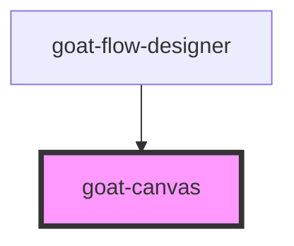

# goat-flow-designer

<!-- Auto Generated Below -->

## Properties

| Property  | Attribute | Description | Type     | Default     |
| --------- | --------- | ----------- | -------- | ----------- |
| `padding` | `padding` |             | `number` | `1`         |
| `shapes`  | --        |             | `any[]`  | `[]`        |
| `viewbox` | `viewbox` |             | `string` | `undefined` |
| `zoom`    | `zoom`    |             | `number` | `1`         |

## Dependencies

### Used by

 - [goat-flow-designer](../flow-designer)

### Graph

----------------------------------------------

*Built with love!*
