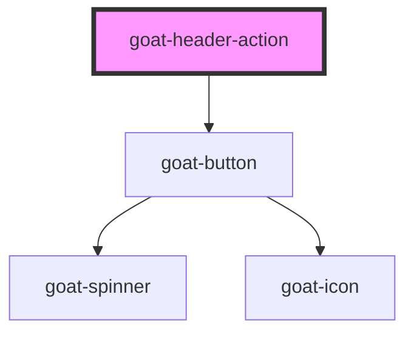

# p4-top-navigation

<!-- Auto Generated Below -->

## Properties

| Property     | Attribute     | Description                                                                                             | Type                                              | Default     |
| ------------ | ------------- | ------------------------------------------------------------------------------------------------------- | ------------------------------------------------- | ----------- |
| `badge`      | `badge`       |                                                                                                         | `string`                                          | `'_self'`   |
| `configAria` | `config-aria` |                                                                                                         | `any`                                             | `{}`        |
| `href`       | `href`        | Hyperlink to navigate to on click.                                                                      | `string`                                          | `undefined` |
| `icon`       | `icon`        | Icon which will displayed on button. Possible values are icon names.                                    | `string`                                          | `undefined` |
| `selected`   | `selected`    | Button selection state.                                                                                 | `boolean`                                         | `false`     |
| `size`       | `size`        | Button size. Possible values are `"sm"`, `"md"`, `"lg"`, `"xl"`, `"xxl"`, `"none"`. Defaults to `"md"`. | `"lg" \| "md" \| "none" \| "sm" \| "xl" \| "xxl"` | `'md'`      |
| `target`     | `target`      | Sets or retrieves the window or frame at which to target content.                                       | `string`                                          | `'_self'`   |

## Methods

### `setColor(color: string) => Promise<void>`

#### Parameters

| Name    | Type     | Description |
| ------- | -------- | ----------- |
| `color` | `string` |             |

#### Returns

Type: `Promise<void>`

## Dependencies

### Depends on

- [goat-button](../../../button/button)

### Graph

----------------------------------------------

*Built with love!*
