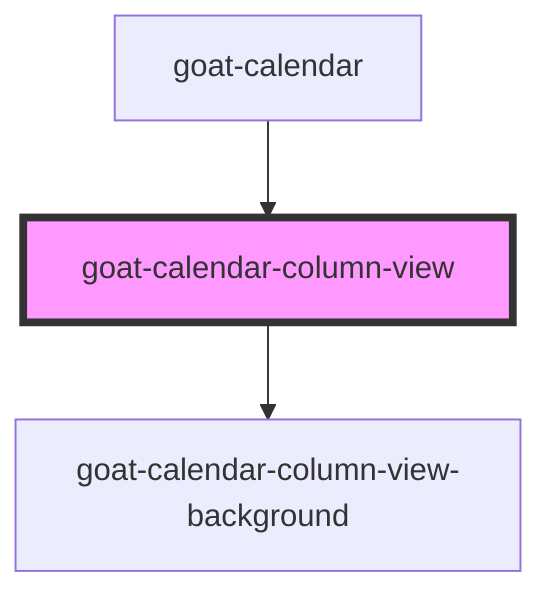

# goat-calendar-column-view

<!-- Auto Generated Below -->

## Properties

| Property      | Attribute | Description | Type     | Default     |
| ------------- | --------- | ----------- | -------- | ----------- |
| `contextDate` | --        |             | `Date`   | `undefined` |
| `currentTime` | --        |             | `Date`   | `undefined` |
| `days`        | `days`    |             | `number` | `7`         |
| `events`      | --        |             | `any[]`  | `[]`        |
| `view`        | `view`    |             | `string` | `'week'`    |

## Dependencies

### Used by

 - [goat-calendar](..)

### Depends on

- [goat-calendar-column-view-background](column-view-background)

### Graph

----------------------------------------------

*Built with love!*
