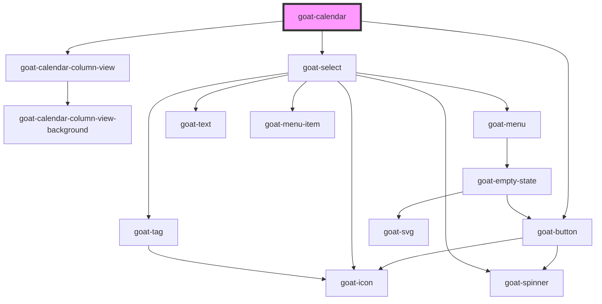

# goat-avatar

<!-- Auto Generated Below -->

## Properties

| Property         | Attribute         | Description  | Type      | Default                                                                                                                                                                                                     |
| ---------------- | ----------------- | ------------ | --------- | ----------------------------------------------------------------------------------------------------------------------------------------------------------------------------------------------------------- |
| `availableViews` | `available-views` |              | `any`     | `[{ label: 'Day', value: 'day', type: 'column', days: 1 }, {     label: 'Week',     value: 'week',     type: 'column',     days: 7,   }, {     label: 'Month',     value: 'month',     type: 'month',   }]` |
| `contextDate`    | `context-date`    |              | `any`     | `undefined`                                                                                                                                                                                                 |
| `events`         | --                |              | `any[]`   | `[]`                                                                                                                                                                                                        |
| `showLoader`     | `show-loader`     | Show loader. | `boolean` | `false`                                                                                                                                                                                                     |
| `timezone`       | `timezone`        |              | `any`     | `undefined`                                                                                                                                                                                                 |
| `view`           | `view`            |              | `string`  | `'week'`                                                                                                                                                                                                    |

## Dependencies

### Depends on

- [goat-calendar-column-view](column-view)
- [goat-button](../../controls/button)
- [goat-select](../../form/select)

### Graph

----------------------------------------------

*Built with love!*
