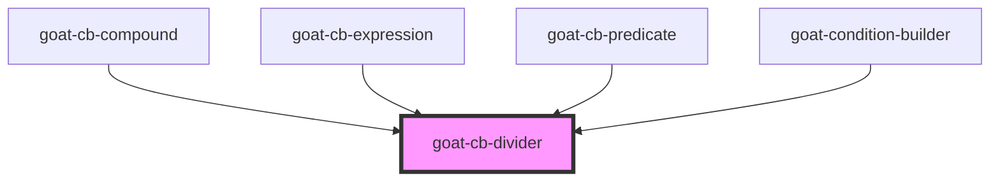

# goat-icon

<!-- Auto Generated Below -->

## Properties

| Property       | Attribute       | Description | Type      | Default |
| -------------- | --------------- | ----------- | --------- | ------- |
| `connectEnd`   | `connect-end`   |             | `boolean` | `false` |
| `connectStart` | `connect-start` |             | `boolean` | `false` |
| `vertical`     | `vertical`      |             | `boolean` | `false` |

## Dependencies

### Used by

 - [goat-cb-compound](../cb-compound)
 - [goat-cb-expression](../cb-expression)
 - [goat-cb-predicate](../cb-predicate)
 - [goat-condition-builder](../condition-builder)

### Graph

----------------------------------------------

*Built with love!*
