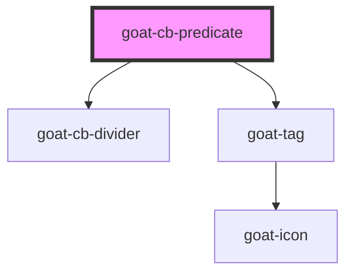

# goat-icon

<!-- Auto Generated Below -->

## Properties

| Property   | Attribute  | Description | Type                            | Default    |
| ---------- | ---------- | ----------- | ------------------------------- | ---------- |
| `position` | `position` |             | `"first" \| "last" \| "middle"` | `'middle'` |

## Dependencies

### Depends on

- [goat-cb-divider](../cb-divider)
- [goat-tag](../../data-display/tag)

### Graph

----------------------------------------------

*Built with love!*
