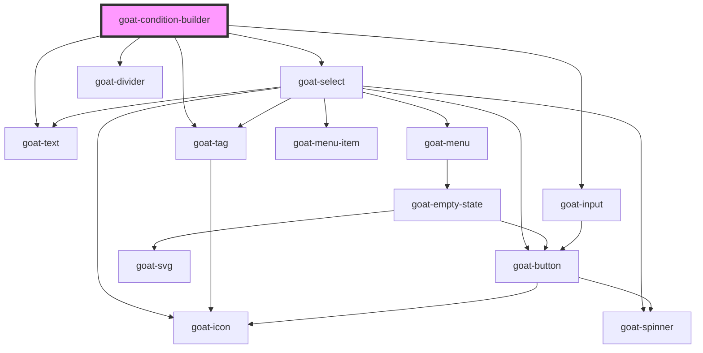

# goat-icon

<!-- Auto Generated Below -->

## Properties

| Property  | Attribute | Description | Type     | Default     |
| --------- | --------- | ----------- | -------- | ----------- |
| `content` | `content` |             | `string` | `undefined` |

## Dependencies

### Depends on

- [goat-select](../../data-entry/select)
- [goat-input](../../data-entry/input/input)
- [goat-text](../../general/text)
- [goat-tag](../../data-display/tag)
- [goat-divider](../../layout/divider)

### Graph

----------------------------------------------

*Built with love!*
