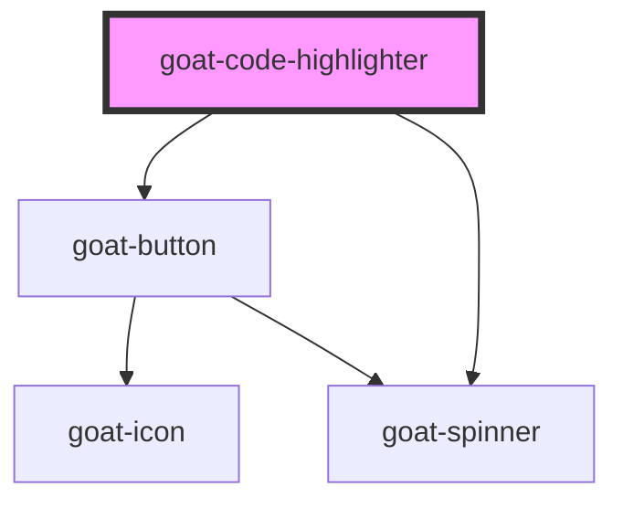

# goat-code-editor

<!-- Auto Generated Below -->

## Properties

| Property      | Attribute      | Description | Type                                                                                                                                                                                                                                                                                                                                                                                                                                                                                                                                                                                                                                                                                                                                                                                                                                                                                                                                                                                                                                                                                                                                                                                                                                                                                                                                                                                                                                                                                                                                                                                                                                                                                                                                                                                                    | Default        |
| ------------- | -------------- | ----------- | ------------------------------------------------------------------------------------------------------------------------------------------------------------------------------------------------------------------------------------------------------------------------------------------------------------------------------------------------------------------------------------------------------------------------------------------------------------------------------------------------------------------------------------------------------------------------------------------------------------------------------------------------------------------------------------------------------------------------------------------------------------------------------------------------------------------------------------------------------------------------------------------------------------------------------------------------------------------------------------------------------------------------------------------------------------------------------------------------------------------------------------------------------------------------------------------------------------------------------------------------------------------------------------------------------------------------------------------------------------------------------------------------------------------------------------------------------------------------------------------------------------------------------------------------------------------------------------------------------------------------------------------------------------------------------------------------------------------------------------------------------------------------------------------------------- | -------------- |
| `language`    | `language`     |             | `"markup" \| "css" \| "clike" \| "javascript" \| "abap" \| "actionscript" \| "ada" \| "apacheconf" \| "apl" \| "applescript" \| "arduino" \| "arff" \| "asciidoc" \| "asm6502" \| "aspnet" \| "autohotkey" \| "autoit" \| "bash" \| "basic" \| "batch" \| "bison" \| "brainfuck" \| "bro" \| "c" \| "csharp" \| "cpp" \| "coffeescript" \| "clojure" \| "crystal" \| "csp" \| "css-extras" \| "d" \| "dart" \| "diff" \| "django" \| "docker" \| "eiffel" \| "elixir" \| "elm" \| "erb" \| "erlang" \| "fsharp" \| "flow" \| "fortran" \| "gedcom" \| "gherkin" \| "git" \| "glsl" \| "gml" \| "go" \| "graphql" \| "groovy" \| "haml" \| "handlebars" \| "haskell" \| "haxe" \| "http" \| "hpkp" \| "hsts" \| "ichigojam" \| "icon" \| "inform7" \| "ini" \| "io" \| "j" \| "java" \| "jolie" \| "json" \| "julia" \| "keyman" \| "kotlin" \| "latex" \| "less" \| "liquid" \| "lisp" \| "livescript" \| "lolcode" \| "lua" \| "makefile" \| "markdown" \| "markup-templating" \| "matlab" \| "mel" \| "mizar" \| "monkey" \| "n4js" \| "nasm" \| "nginx" \| "nim" \| "nix" \| "nsis" \| "objectivec" \| "ocaml" \| "opencl" \| "oz" \| "parigp" \| "parser" \| "pascal" \| "perl" \| "php" \| "php-extras" \| "plsql" \| "powershell" \| "processing" \| "prolog" \| "properties" \| "protobuf" \| "pug" \| "puppet" \| "pure" \| "python" \| "q" \| "qore" \| "r" \| "jsx" \| "tsx" \| "renpy" \| "reason" \| "rest" \| "rip" \| "roboconf" \| "ruby" \| "rust" \| "sas" \| "sass" \| "scss" \| "scala" \| "scheme" \| "smalltalk" \| "smarty" \| "sql" \| "soy" \| "stylus" \| "swift" \| "tap" \| "tcl" \| "textile" \| "tt2" \| "twig" \| "typescript" \| "vbnet" \| "velocity" \| "verilog" \| "vhdl" \| "vim" \| "visual-basic" \| "wasm" \| "wiki" \| "xeora" \| "xojo" \| "xquery" \| "yaml"` | `'javascript'` |
| `lineNumbers` | `line-numbers` |             | `boolean`                                                                                                                                                                                                                                                                                                                                                                                                                                                                                                                                                                                                                                                                                                                                                                                                                                                                                                                                                                                                                                                                                                                                                                                                                                                                                                                                                                                                                                                                                                                                                                                                                                                                                                                                                                                               | `false`        |
| `value`       | `value`        |             | `string`                                                                                                                                                                                                                                                                                                                                                                                                                                                                                                                                                                                                                                                                                                                                                                                                                                                                                                                                                                                                                                                                                                                                                                                                                                                                                                                                                                                                                                                                                                                                                                                                                                                                                                                                                                                                | `''`           |

## Dependencies

### Depends on

- [goat-button](../../form/button)
- [goat-spinner](../spinner)

### Graph

----------------------------------------------

*Built with love!*
