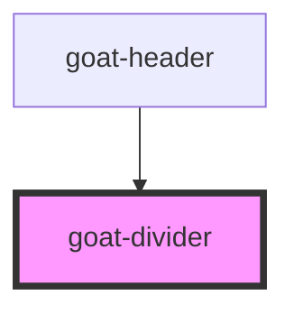

# goat-heading

<!-- Auto Generated Below -->

## Properties

| Property   | Attribute  | Description | Type      | Default |
| ---------- | ---------- | ----------- | --------- | ------- |
| `vertical` | `vertical` |             | `boolean` | `false` |

## Dependencies

### Used by

 - [goat-header](../../navigation/goat-header)

### Graph

----------------------------------------------

*Built with love!*
