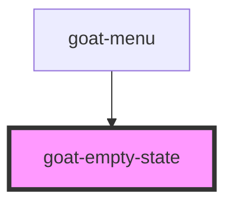

# goat-heading

<!-- Auto Generated Below -->

## Properties

| Property       | Attribute      | Description | Type        | Default     |
| -------------- | -------------- | ----------- | ----------- | ----------- |
| `illustration` | `illustration` |             | `"no-data"` | `'no-data'` |
| `vertical`     | `vertical`     |             | `boolean`   | `false`     |

## Dependencies

### Used by

 - [goat-menu](../../menus/menu)

### Graph

----------------------------------------------

*Built with love!*
