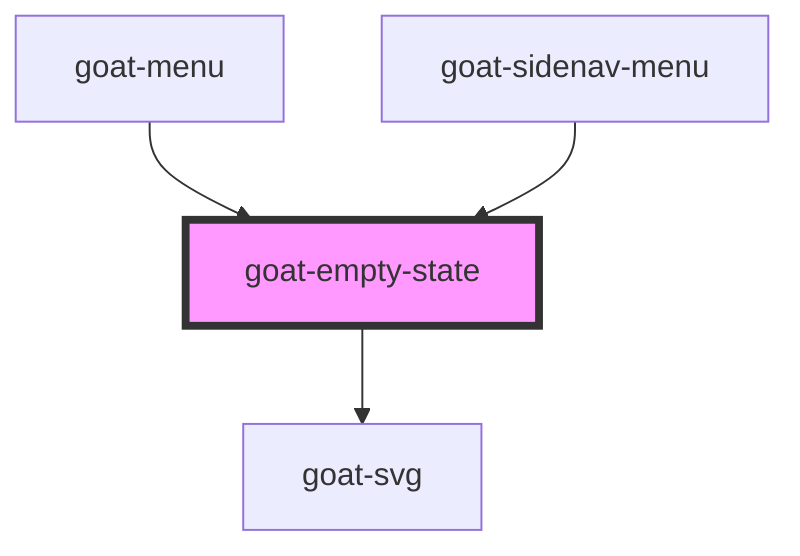

# goat-heading

<!-- Auto Generated Below -->

## Properties

| Property       | Attribute      | Description | Type            | Default         |
| -------------- | -------------- | ----------- | --------------- | --------------- |
| `illustration` | `illustration` |             | `"no-document"` | `'no-document'` |
| `vertical`     | `vertical`     |             | `boolean`       | `false`         |

## Dependencies

### Used by

 - [goat-menu](../../menu/menu)
 - [goat-sidenav-menu](../../app-shell/sidenav-menu)

### Depends on

- [goat-svg](../svg)

### Graph

----------------------------------------------

*Built with love!*
