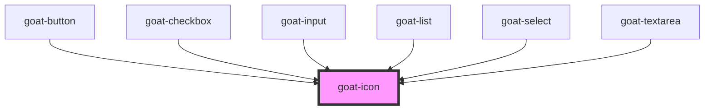

# goat-icon

<!-- Auto Generated Below -->

## Properties

| Property | Attribute | Description                                                                     | Type     | Default     |
| -------- | --------- | ------------------------------------------------------------------------------- | -------- | ----------- |
| `size`   | `size`    | The Icon size. Possible values are: `"sm"`, `"md"`, `"lg"`. Defaults to `"md"`. | `string` | `'md'`      |
| `type`   | `type`    |                                                                                 | `string` | `undefined` |

## Dependencies

### Used by

 - [goat-button](../goat-button)
 - [goat-checkbox](../goat-checkbox)
 - [goat-input](../goat-input)
 - [goat-list](../goat-list)
 - [goat-select](../goat-select)
 - [goat-textarea](../goat-textarea)

### Graph

----------------------------------------------

*Built with love!*
