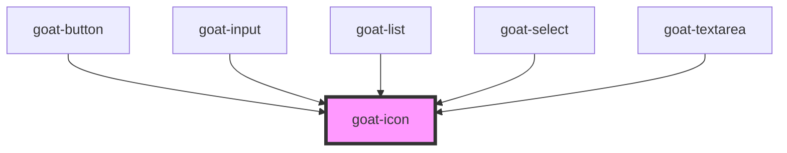

# goat-icon

<!-- Auto Generated Below -->

## Properties

| Property | Attribute | Description                                                                                                    | Type                                                                         | Default              |
| -------- | --------- | -------------------------------------------------------------------------------------------------------------- | ---------------------------------------------------------------------------- | -------------------- |
| `color`  | `color`   | Color variants. Possible values are `"primary"`, `"success"`, `"warning"`, `"error"`. Defaults to `"primary"`. | `"default" \| "error" \| "primary" \| "secondary" \| "success" \| "warning"` | `'default'`          |
| `size`   | `size`    | The Icon size. Possible values are: `"sm"`, `"md"`, `"lg"`, `"xl"` and size in pixel. Defaults to `"md"`.      | `string`                                                                     | `ElementSize.MEDIUM` |
| `type`   | `type`    |                                                                                                                | `string`                                                                     | `undefined`          |

## Dependencies

### Used by

 - [goat-button](../../input-controls/button)
 - [goat-input](../../input-controls/input)
 - [goat-list](../../other/list)
 - [goat-select](../../input-controls/select)
 - [goat-textarea](../../input-controls/textarea)

### Graph

----------------------------------------------

*Built with love!*
