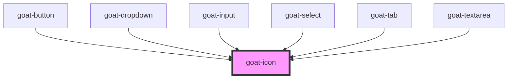

# goat-icon

<!-- Auto Generated Below -->

## Properties

| Property | Attribute | Description                                                                                               | Type     | Default     |
| -------- | --------- | --------------------------------------------------------------------------------------------------------- | -------- | ----------- |
| `name`   | `name`    |                                                                                                           | `string` | `undefined` |
| `size`   | `size`    | The Icon size. Possible values are: `"sm"`, `"md"`, `"lg"`, `"xl"` and size in pixel. Defaults to `"md"`. | `string` | `'md'`      |

## Dependencies

### Used by

 - [goat-button](../../form/button)
 - [goat-dropdown](../../menu/dropdown)
 - [goat-input](../../form/input)
 - [goat-select](../../form/select)
 - [goat-tab](../../navigation/tab)
 - [goat-textarea](../../form/textarea)

### Graph

----------------------------------------------

*Built with love!*
