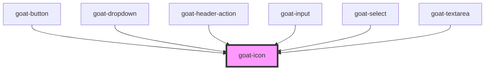

# goat-icon

<!-- Auto Generated Below -->

## Properties

| Property | Attribute | Description                                                                                               | Type     | Default   |
| -------- | --------- | --------------------------------------------------------------------------------------------------------- | -------- | --------- |
| `size`   | `size`    | The Icon size. Possible values are: `"sm"`, `"md"`, `"lg"`, `"xl"` and size in pixel. Defaults to `"md"`. | `string` | `'md'`    |
| `type`   | `type`    |                                                                                                           | `string` | `'house'` |

## Dependencies

### Used by

 - [goat-button](../../form/button)
 - [goat-dropdown](../../menu/dropdown)
 - [goat-header-action](../../navigation/goat-header-action)
 - [goat-input](../../form/input)
 - [goat-select](../../form/select)
 - [goat-textarea](../../form/textarea)

### Graph

----------------------------------------------

*Built with love!*
