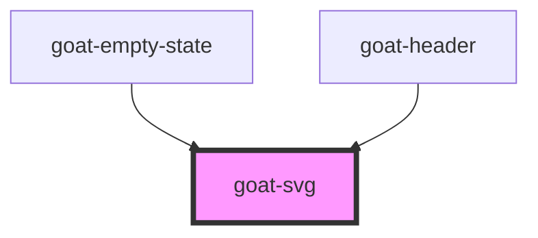

# goat-icon

<!-- Auto Generated Below -->

## Properties

| Property | Attribute | Description | Type     | Default |
| -------- | --------- | ----------- | -------- | ------- |
| `src`    | `src`     |             | `string` | `''`    |

## Dependencies

### Used by

 - [goat-empty-state](../empty-state)
 - [goat-header](../../navigation/header)

### Graph

----------------------------------------------

*Built with love!*
