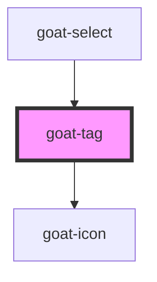

# goat-heading

<!-- Auto Generated Below -->

## Properties

| Property | Attribute | Description | Type           | Default |
| -------- | --------- | ----------- | -------------- | ------- |
| `filter` | `filter`  |             | `boolean`      | `false` |
| `size`   | `size`    | Text size.  | `"md" \| "sm"` | `'md'`  |
| `value`  | `value`   |             | `string`       | `''`    |

## Events

| Event              | Description | Type               |
| ------------------ | ----------- | ------------------ |
| `goat:click`       |             | `CustomEvent<any>` |
| `goat:tag-dismiss` |             | `CustomEvent<any>` |

## Dependencies

### Used by

 - [goat-select](../../form/select)

### Depends on

- [goat-icon](../icon)

### Graph

----------------------------------------------

*Built with love!*
