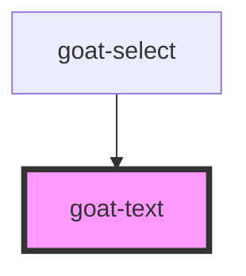

# goat-heading

<!-- Auto Generated Below -->

## Properties

| Property | Attribute | Description        | Type                                     | Default     |
| -------- | --------- | ------------------ | ---------------------------------------- | ----------- |
| `level`  | `level`   | The heading level. | `1 \| 2 \| 3 \| 4 \| 5`                  | `1`         |
| `shade`  | `shade`   |                    | `"primary" \| "secondary" \| "tertiary"` | `'primary'` |
| `size`   | `size`    | Text size.         | `"lg" \| "md" \| "sm" \| "xl" \| "xs"`   | `undefined` |
| `type`   | `type`    |                    | `"heading" \| "paragraph" \| "text"`     | `'text'`    |

## Dependencies

### Used by

 - [goat-select](../../form/select)

### Graph

----------------------------------------------

*Built with love!*
