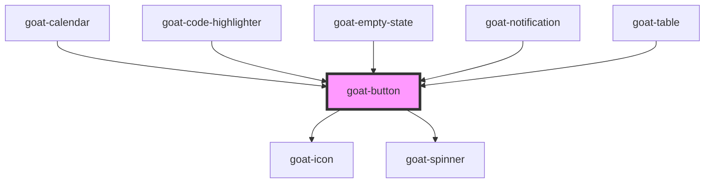

# goat-button

<!-- Auto Generated Below -->

## Properties

| Property         | Attribute         | Description                                                                                   | Type                                                     | Default     |
| ---------------- | ----------------- | --------------------------------------------------------------------------------------------- | -------------------------------------------------------- | ----------- |
| `block`          | `block`           | If true, fits button width to its parent width. Defaults to `false`.                          | `boolean`                                                | `false`     |
| `configAria`     | `config-aria`     |                                                                                               | `any`                                                    | `{}`        |
| `disabled`       | `disabled`        | If true, the user cannot interact with the button. Defaults to `false`.                       | `boolean`                                                | `false`     |
| `disabledReason` | `disabled-reason` |                                                                                               | `string`                                                 | `''`        |
| `href`           | `href`            | Hyperlink to navigate to on click.                                                            | `string`                                                 | `undefined` |
| `icon`           | `icon`            | Icon which will displayed on button. Possible values are bootstrap icon names.                | `string`                                                 | `undefined` |
| `iconEnd`        | `icon-end`        | Icon position.                                                                                | `boolean`                                                | `false`     |
| `selected`       | `selected`        | Button selection state.                                                                       | `boolean`                                                | `false`     |
| `showLoader`     | `show-loader`     | Show loader.                                                                                  | `boolean`                                                | `false`     |
| `size`           | `size`            | Button size. Possible values are `"sm"`, `"md"`, `"lg"`, `"xl"`, `"xxl"`. Defaults to `"md"`. | `"lg" \| "md" \| "sm" \| "xl" \| "xxl"`                  | `'md'`      |
| `target`         | `target`          | Sets or retrieves the window or frame at which to target content.                             | `string`                                                 | `'_self'`   |
| `variant`        | `variant`         |                                                                                               | `"default" \| "ghost" \| "light" \| "link" \| "outline"` | `'default'` |

## Events

| Event        | Description                                                       | Type               |
| ------------ | ----------------------------------------------------------------- | ------------------ |
| `goat:click` | On click of button, a CustomEvent 'goat:click' will be triggered. | `CustomEvent<any>` |

## Methods

### `setBlur() => Promise<void>`

Sets blur on the native `button` in `goat-button`. Use this method instead of the global
`button.blur()`.

#### Returns

Type: `Promise<void>`

### `setFocus() => Promise<void>`

Sets focus on the native `button` in `goat-button`. Use this method instead of the global
`button.focus()`.

#### Returns

Type: `Promise<void>`

### `triggerClick() => Promise<void>`

#### Returns

Type: `Promise<void>`

## Dependencies

### Used by

 - [goat-calendar](../../calendar/calendar)
 - [goat-code-highlighter](../../content/code-highlighter)
 - [goat-empty-state](../../content/empty-state)
 - [goat-notification](../../content/notification)
 - [goat-table](../../table/table)

### Depends on

- [goat-icon](../../content/icon)
- [goat-spinner](../../content/spinner)

### Graph

----------------------------------------------

*Built with love!*
