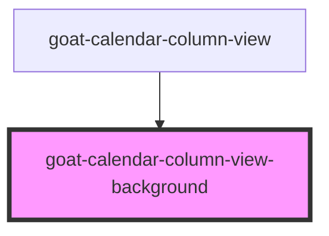

# goat-calendar-column-view-background

<!-- Auto Generated Below -->

## Properties

| Property  | Attribute | Description | Type     | Default |
| --------- | --------- | ----------- | -------- | ------- |
| `columns` | `columns` |             | `number` | `1`     |

## Dependencies

### Used by

 - [goat-calendar-column-view](..)

### Graph

----------------------------------------------

*Built with love!*
