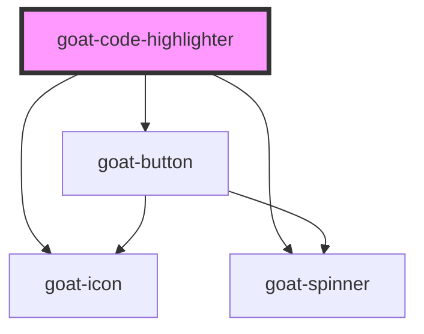

# goat-code-editor

<!-- Auto Generated Below -->

## Properties

| Property      | Attribute      | Description | Type      | Default               |
| ------------- | -------------- | ----------- | --------- | --------------------- |
| `language`    | `language`     |             | `string`  | `Language.javascript` |
| `lineNumbers` | `line-numbers` |             | `boolean` | `false`               |
| `value`       | `value`        |             | `string`  | `''`                  |

## Dependencies

### Depends on

- [goat-button](../../general/button)
- [goat-icon](../../general/icon)
- [goat-spinner](../../feedback/spinner)

### Graph

----------------------------------------------

*Built with love!*
