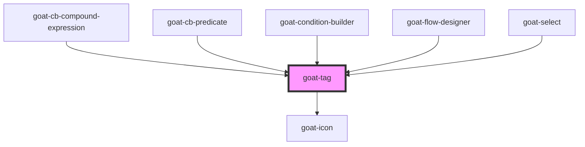

# goat-heading

<!-- Auto Generated Below -->

## Properties

| Property   | Attribute   | Description | Type                                                                                                           | Default  |
| ---------- | ----------- | ----------- | -------------------------------------------------------------------------------------------------------------- | -------- |
| `color`    | `color`     |             | `"blue" \| "error" \| "gray" \| "green" \| "info" \| "primary" \| "red" \| "success" \| "warning" \| "yellow"` | `'gray'` |
| `filter`   | `filter`    |             | `boolean`                                                                                                      | `false`  |
| `imageSrc` | `image-src` |             | `string`                                                                                                       | `''`     |
| `size`     | `size`      | Text size.  | `"md" \| "sm"`                                                                                                 | `'md'`   |
| `value`    | `value`     |             | `string`                                                                                                       | `''`     |

## Events

| Event              | Description | Type               |
| ------------------ | ----------- | ------------------ |
| `goat:click`       |             | `CustomEvent<any>` |
| `goat:tag-dismiss` |             | `CustomEvent<any>` |

## Dependencies

### Used by

 - [goat-cb-compound-expression](../../condition-builder/cb-compound-expression)
 - [goat-cb-predicate](../../condition-builder/cb-predicate)
 - [goat-condition-builder](../../condition-builder/condition-builder)
 - [goat-flow-designer](../../flow-designer/flow-designer)
 - [goat-select](../../data-entry/select)

### Depends on

- [goat-icon](../../general/icon)

### Graph

----------------------------------------------

*Built with love!*
