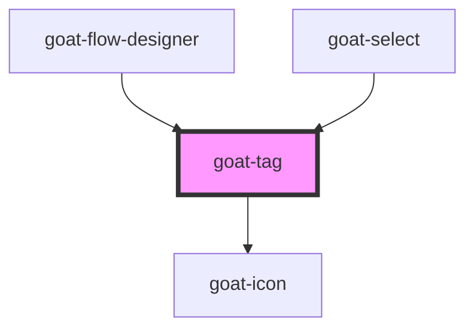

# goat-heading

<!-- Auto Generated Below -->

## Properties

| Property   | Attribute   | Description | Type           | Default |
| ---------- | ----------- | ----------- | -------------- | ------- |
| `filter`   | `filter`    |             | `boolean`      | `false` |
| `imageSrc` | `image-src` |             | `string`       | `''`    |
| `size`     | `size`      | Text size.  | `"md" \| "sm"` | `'md'`  |
| `value`    | `value`     |             | `string`       | `''`    |

## Events

| Event              | Description | Type               |
| ------------------ | ----------- | ------------------ |
| `goat:click`       |             | `CustomEvent<any>` |
| `goat:tag-dismiss` |             | `CustomEvent<any>` |

## Dependencies

### Used by

 - [goat-flow-designer](../../flow-designer/flow-designer)
 - [goat-select](../../data-entry/select)

### Depends on

- [goat-icon](../../general/icon)

### Graph

----------------------------------------------

*Built with love!*
