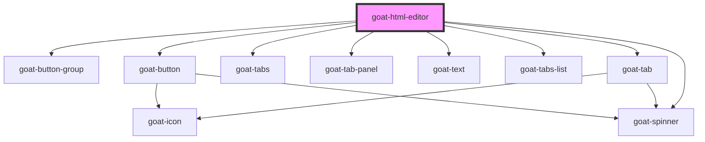

# goat-code-editor

<!-- Auto Generated Below -->

## Properties

| Property      | Attribute      | Description                                                                                            | Type                      | Default                    |
| ------------- | -------------- | ------------------------------------------------------------------------------------------------------ | ------------------------- | -------------------------- |
| `debounce`    | `debounce`     | Set the amount of time, in milliseconds, to wait to trigger the `onChange` event after each keystroke. | `number`                  | `250`                      |
| `disabled`    | `disabled`     | If true, the user cannot interact with the button. Defaults to `false`.                                | `boolean`                 | `false`                    |
| `lineNumbers` | `line-numbers` |                                                                                                        | `"off" \| "on"`           | `'on'`                     |
| `name`        | `name`         | The input field name.                                                                                  | `string`                  | ``goat-input-${this.gid}`` |
| `readonly`    | `readonly`     |                                                                                                        | `boolean`                 | `false`                    |
| `required`    | `required`     | If true, required icon is show. Defaults to `false`.                                                   | `boolean`                 | `false`                    |
| `theme`       | `theme`        |                                                                                                        | `"vs-dark" \| "vs-light"` | `'vs-light'`               |
| `value`       | `value`        | The input field value.                                                                                 | `string`                  | `undefined`                |

## Events

| Event         | Description                          | Type               |
| ------------- | ------------------------------------ | ------------------ |
| `goat:change` | Emitted when the value has changed.. | `CustomEvent<any>` |

## Methods

### `getComponentId() => Promise<string>`

#### Returns

Type: `Promise<string>`

### `setBlur() => Promise<void>`

Sets blur on the native `input` in `goat-input`. Use this method instead of the global
`input.blur()`.

#### Returns

Type: `Promise<void>`

### `setFocus() => Promise<void>`

Sets focus on the native `input` in `goat-input`. Use this method instead of the global
`input.focus()`.

#### Returns

Type: `Promise<void>`

## Dependencies

### Depends on

- [goat-button-group](../../button-group)
- [goat-button](../../button)
- [goat-tabs](../../tabs/tabs)
- [goat-tab-panel](../../tabs/tab-panel)
- [goat-text](../../text)
- [goat-tabs-list](../../tabs/tabs-list)
- [goat-tab](../../tabs/tab)
- [goat-spinner](../../spinner)

### Graph

----------------------------------------------

*Built with love!*
