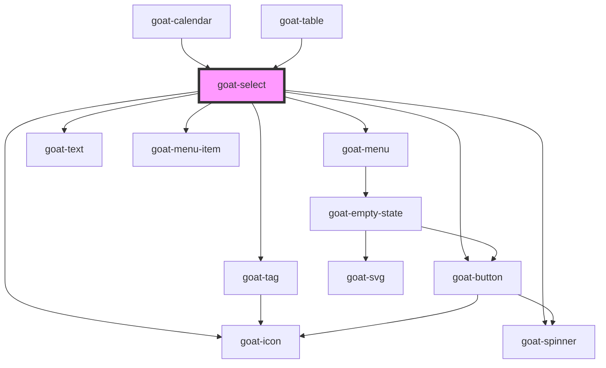

# goat-select

<!-- Auto Generated Below -->

## Properties

| Property           | Attribute            | Description                                                                                                    | Type                                             | Default                                         |
| ------------------ | -------------------- | -------------------------------------------------------------------------------------------------------------- | ------------------------------------------------ | ----------------------------------------------- |
| `clearable`        | `clearable`          | If `true`, a clear icon will appear in the input when there is a value. Clicking it clears the input.          | `boolean`                                        | `false`                                         |
| `configAria`       | `config-aria`        |                                                                                                                | `any`                                            | `{}`                                            |
| `debounce`         | `debounce`           | Set the amount of time, in milliseconds, to wait to trigger the `goatChange` event after each keystroke.       | `number`                                         | `300`                                           |
| `disabled`         | `disabled`           | If true, the user cannot interact with the button. Defaults to `false`.                                        | `boolean`                                        | `false`                                         |
| `hideDropdownIcon` | `hide-dropdown-icon` |                                                                                                                | `boolean`                                        | `false`                                         |
| `isOpen`           | `is-open`            |                                                                                                                | `boolean`                                        | `false`                                         |
| `items`            | `items`              | [{   label: 'Shivaji Varma',   value: 'shivaji-varma',   icon: 'person' }]                                     | `any`                                            | `[]`                                            |
| `multiple`         | `multiple`           |                                                                                                                | `boolean`                                        | `false`                                         |
| `name`             | `name`               | The input field name.                                                                                          | `string`                                         | ``goat-input-${this.gid}``                      |
| `placeholder`      | `placeholder`        | The input field placeholder.                                                                                   | `string`                                         | `undefined`                                     |
| `positions`        | `positions`          |                                                                                                                | `string`                                         | `'bottom-right,top-right,bottom-left,top-left'` |
| `readonly`         | `readonly`           | If true, the user cannot interact with the button. Defaults to `false`.                                        | `boolean`                                        | `false`                                         |
| `required`         | `required`           | If true, required icon is show. Defaults to `false`.                                                           | `boolean`                                        | `false`                                         |
| `search`           | `search`             | Search type Possible values are `"none"`, `"initial"`, `"contains"`, `"managed"`. Defaults to `"none"`.        | `"contains" \| "initial" \| "managed" \| "none"` | `'none'`                                        |
| `showLoader`       | `show-loader`        |                                                                                                                | `boolean`                                        | `false`                                         |
| `size`             | `size`               | The select input size. Possible values are: `"sm"`, `"md"`, `"lg"`. Defaults to `"md"`.                        | `"lg" \| "md" \| "sm"`                           | `'md'`                                          |
| `state`            | `state`              | The input state. Possible values are: `"success"`, `"error"`, `"warning"`, 'default'. Defaults to `"default"`. | `"default" \| "error" \| "success" \| "warning"` | `'default'`                                     |
| `value`            | `value`              | The input field value.                                                                                         | `number \| string`                               | `''`                                            |

## Events

| Event               | Description                             | Type               |
| ------------------- | --------------------------------------- | ------------------ |
| `goat:change`       | Emitted when the value has changed.     | `CustomEvent<any>` |
| `goat:search`       | Emitted when a keyboard input occurred. | `CustomEvent<any>` |
| `goat:search-enter` |                                         | `CustomEvent<any>` |

## Methods

### `getComponentId() => Promise<string>`

#### Returns

Type: `Promise<string>`

### `setBlur() => Promise<void>`

Sets blur on the native `input` in `goat-input`. Use this method instead of the global
`input.blur()`.

#### Returns

Type: `Promise<void>`

### `setFocus() => Promise<void>`

Sets focus on the native `input` in `ion-input`. Use this method instead of the global
`input.focus()`.

#### Returns

Type: `Promise<void>`

## Dependencies

### Used by

 - [goat-calendar](../../calendar/calendar)
 - [goat-table](../../data-display/table)

### Depends on

- [goat-icon](../../general/icon)
- [goat-tag](../../data-display/tag)
- [goat-button](../../general/button)
- [goat-spinner](../../feedback/spinner)
- [goat-menu](../../navigation/menu/menu)
- [goat-text](../../general/text)
- [goat-menu-item](../../navigation/menu/menu-item)

### Graph

----------------------------------------------

*Built with love!*
