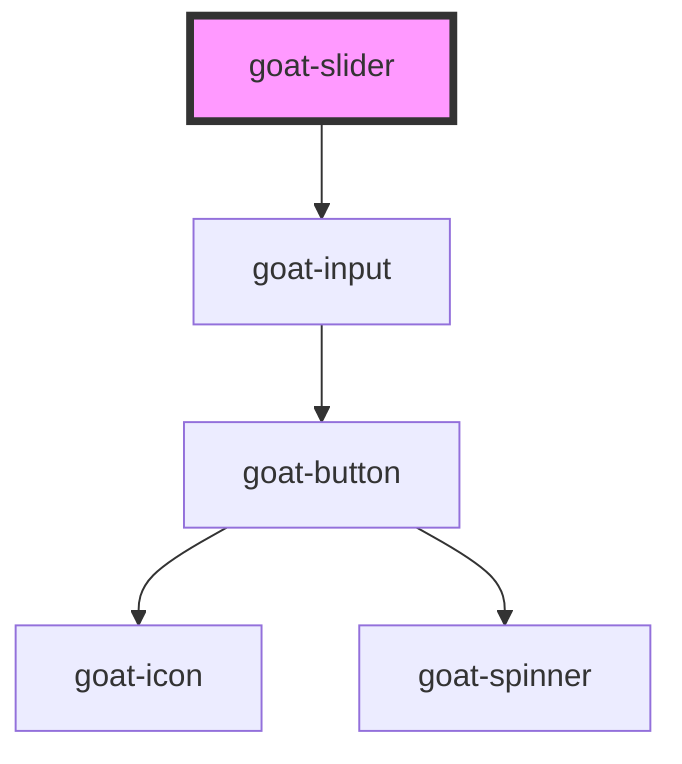

# goat-select

<!-- Auto Generated Below -->

## Properties

| Property     | Attribute     | Description                                                                                              | Type      | Default                    |
| ------------ | ------------- | -------------------------------------------------------------------------------------------------------- | --------- | -------------------------- |
| `configAria` | `config-aria` |                                                                                                          | `any`     | `{}`                       |
| `debounce`   | `debounce`    | Set the amount of time, in milliseconds, to wait to trigger the `goatChange` event after each keystroke. | `number`  | `300`                      |
| `disabled`   | `disabled`    | If true, the user cannot interact with the button. Defaults to `false`.                                  | `boolean` | `false`                    |
| `max`        | `max`         |                                                                                                          | `number`  | `100`                      |
| `min`        | `min`         |                                                                                                          | `number`  | `0`                        |
| `name`       | `name`        | The input field name.                                                                                    | `string`  | ``goat-input-${this.gid}`` |
| `readonly`   | `readonly`    | If true, the user cannot interact with the button. Defaults to `false`.                                  | `boolean` | `false`                    |
| `required`   | `required`    | If true, required icon is show. Defaults to `false`.                                                     | `boolean` | `false`                    |
| `value`      | `value`       | The input field value.                                                                                   | `number`  | `0`                        |

## Events

| Event         | Description                         | Type               |
| ------------- | ----------------------------------- | ------------------ |
| `goat:change` | Emitted when the value has changed. | `CustomEvent<any>` |
| `goat:input`  |                                     | `CustomEvent<any>` |

## Methods

### `getComponentId() => Promise<string>`

#### Returns

Type: `Promise<string>`

### `setBlur() => Promise<void>`

Sets blur on the native `input` in `goat-input`. Use this method instead of the global
`input.blur()`.

#### Returns

Type: `Promise<void>`

### `setFocus() => Promise<void>`

Sets focus on the native `input` in `ion-input`. Use this method instead of the global
`input.focus()`.

#### Returns

Type: `Promise<void>`

## Dependencies

### Depends on

- [goat-input](../input)

### Graph

----------------------------------------------

*Built with love!*
