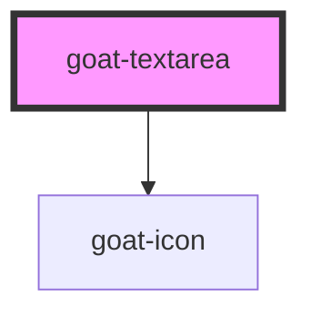

# goat-textarea

<!-- Auto Generated Below -->

## Properties

| Property      | Attribute      | Description                                                                                                    | Type                                             | Default                    |
| ------------- | -------------- | -------------------------------------------------------------------------------------------------------------- | ------------------------------------------------ | -------------------------- |
| `clearable`   | `clearable`    | If `true`, a clear icon will appear in the input when there is a value. Clicking it clears the input.          | `boolean`                                        | `false`                    |
| `configAria`  | `config-aria`  |                                                                                                                | `any`                                            | `{}`                       |
| `debounce`    | `debounce`     | Set the amount of time, in milliseconds, to wait to trigger the `goat:change` event after each keystroke.      | `number`                                         | `300`                      |
| `disabled`    | `disabled`     | If true, the user cannot interact with the button. Defaults to `false`.                                        | `boolean`                                        | `false`                    |
| `helperText`  | `helper-text`  |                                                                                                                | `string`                                         | `undefined`                |
| `inline`      | `inline`       |                                                                                                                | `boolean`                                        | `false`                    |
| `invalid`     | `invalid`      |                                                                                                                | `boolean`                                        | `false`                    |
| `invalidText` | `invalid-text` |                                                                                                                | `string`                                         | `undefined`                |
| `label`       | `label`        |                                                                                                                | `string`                                         | `undefined`                |
| `name`        | `name`         | The input field name.                                                                                          | `string`                                         | ``goat-input-${this.gid}`` |
| `placeholder` | `placeholder`  | The input field placeholder.                                                                                   | `string`                                         | `undefined`                |
| `readonly`    | `readonly`     | If true, the user read the value cannot modify it. Defaults to `false`.                                        | `boolean`                                        | `false`                    |
| `required`    | `required`     | If true, required icon is show. Defaults to `false`.                                                           | `boolean`                                        | `false`                    |
| `state`       | `state`        | The input state. Possible values are: `"success"`, `"error"`, `"warning"`, 'default'. Defaults to `"default"`. | `"default" \| "error" \| "success" \| "warning"` | `'default'`                |
| `value`       | `value`        | The input field value.                                                                                         | `string`                                         | `undefined`                |
| `warn`        | `warn`         |                                                                                                                | `boolean`                                        | `false`                    |
| `warnText`    | `warn-text`    |                                                                                                                | `string`                                         | `undefined`                |

## Events

| Event               | Description                                | Type               |
| ------------------- | ------------------------------------------ | ------------------ |
| `goat:action-click` | Emitted when the action button is clicked. | `CustomEvent<any>` |
| `goat:blur`         | Emitted when the input loses focus.        | `CustomEvent<any>` |
| `goat:change`       | Emitted when the value has changed..       | `CustomEvent<any>` |
| `goat:focus`        | Emitted when the input has focus.          | `CustomEvent<any>` |
| `goat:input`        | Emitted when a keyboard input occurred.    | `CustomEvent<any>` |

## Methods

### `getComponentId() => Promise<string>`

#### Returns

Type: `Promise<string>`

### `setBlur() => Promise<void>`

Sets blur on the native `textarea` in `goat-textarea`. Use this method instead of the global
`textarea.blur()`.

#### Returns

Type: `Promise<void>`

### `setFocus() => Promise<void>`

Sets focus on the native `textarea` in `goat-textarea`. Use this method instead of the global
`textarea.focus()`.

#### Returns

Type: `Promise<void>`

## Dependencies

### Depends on

- [goat-icon](../../icon)

### Graph

----------------------------------------------

*Built with love!*
