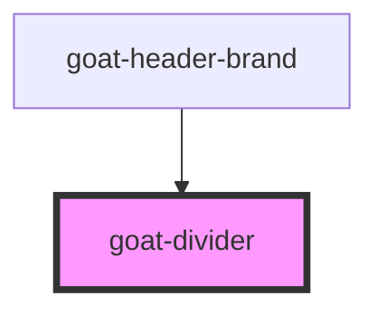

# goat-heading

<!-- Auto Generated Below -->

## Properties

| Property   | Attribute  | Description | Type      | Default |
| ---------- | ---------- | ----------- | --------- | ------- |
| `vertical` | `vertical` |             | `boolean` | `false` |

## CSS Custom Properties

| Name                     | Description            |
| ------------------------ | ---------------------- |
| `--goat-divider-color`   | Color of the divider   |
| `--goat-divider-padding` | Padding of the divider |

## Dependencies

### Used by

 - [goat-header-brand](../application/header/header-brand)

### Graph

----------------------------------------------

*Built with love!*
