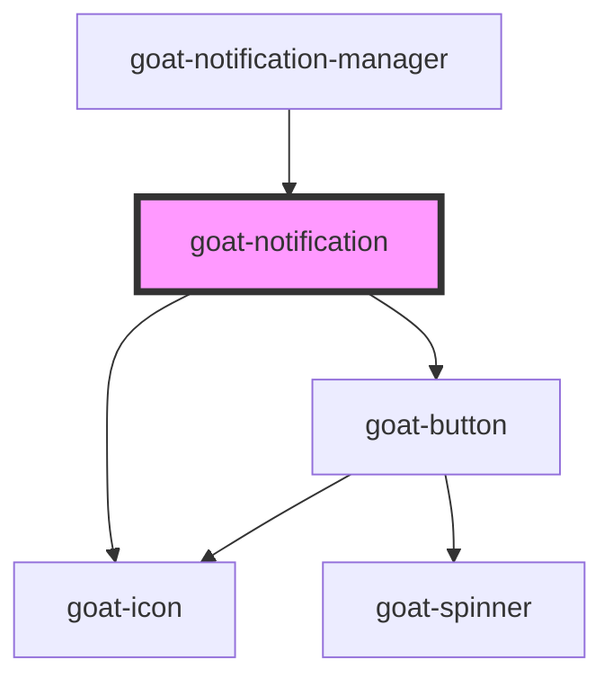

# goat-alert

<!-- Auto Generated Below -->

## Properties

| Property      | Attribute      | Description | Type                                          | Default     |
| ------------- | -------------- | ----------- | --------------------------------------------- | ----------- |
| `actionLabel` | `action-label` |             | `string`                                      | `'Dismiss'` |
| `actionName`  | `action-name`  |             | `string`                                      | `'dismiss'` |
| `actionable`  | `actionable`   |             | `boolean`                                     | `true`      |
| `dismissible` | `dismissible`  |             | `boolean`                                     | `false`     |
| `lowContrast` | `low-contrast` |             | `boolean`                                     | `false`     |
| `state`       | `state`        |             | `"error" \| "info" \| "success" \| "warning"` | `'info'`    |

## Events

| Event          | Description | Type               |
| -------------- | ----------- | ------------------ |
| `goat:dismiss` |             | `CustomEvent<any>` |

## Dependencies

### Used by

 - [goat-notification-manager](../notification-manager)

### Depends on

- [goat-button](../../general/button)
- [goat-icon](../../general/icon)

### Graph

----------------------------------------------

*Built with love!*
