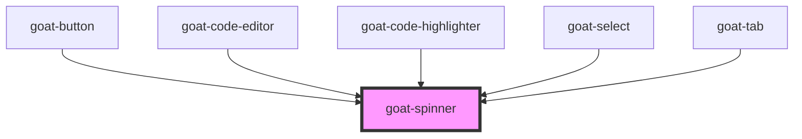

# goat-spinner

<!-- Auto Generated Below -->

## Properties

| Property | Attribute | Description                                                                                               | Type     | Default |
| -------- | --------- | --------------------------------------------------------------------------------------------------------- | -------- | ------- |
| `size`   | `size`    | The Icon size. Possible values are: `"sm"`, `"md"`, `"lg"`, `"xl"` and size in pixel. Defaults to `"md"`. | `string` | `'md'`  |

## Dependencies

### Used by

 - [goat-button](../../general/button)
 - [goat-code-editor](../../data-entry/code-editor)
 - [goat-code-highlighter](../../data-display/code-highlighter)
 - [goat-select](../../data-entry/select)
 - [goat-tab](../../navigation/tabs/tab)

### Graph

----------------------------------------------

*Built with love!*
