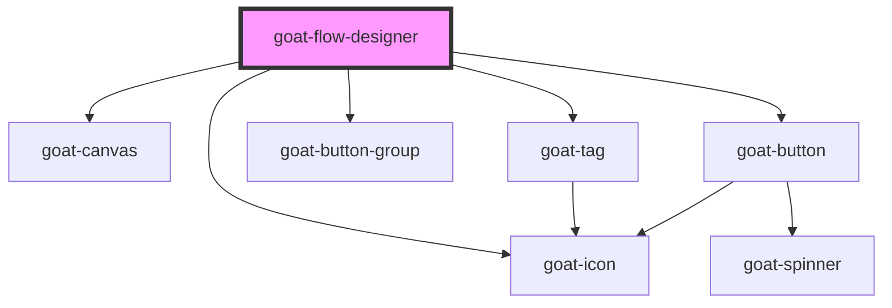

# goat-flow-designer

<!-- Auto Generated Below -->

## Properties

| Property     | Attribute    | Description | Type      | Default |
| ------------ | ------------ | ----------- | --------- | ------- |
| `activities` | --           |             | `any[]`   | `[]`    |
| `blockSize`  | `block-size` |             | `number`  | `16`    |
| `disabled`   | `disabled`   |             | `boolean` | `false` |

## Dependencies

### Depends on

- [goat-canvas](../canvas)
- [goat-icon](../../general/icon)
- [goat-tag](../../data-display/tag)
- [goat-button-group](../../general/button-group)
- [goat-button](../../general/button)

### Graph

----------------------------------------------

*Built with love!*
