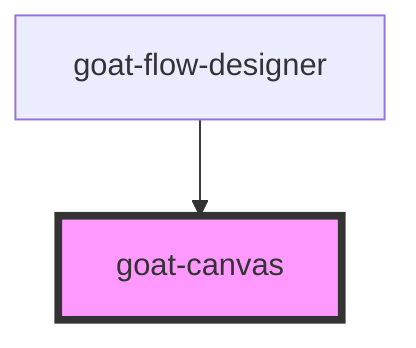

# goat-flow-designer

<!-- Auto Generated Below -->

## Properties

| Property   | Attribute   | Description | Type     | Default     |
| ---------- | ----------- | ----------- | -------- | ----------- |
| `lines`    | --          |             | `any[]`  | `[]`        |
| `padding`  | `padding`   |             | `number` | `2`         |
| `unitSize` | `unit-size` |             | `number` | `16`        |
| `viewbox`  | `viewbox`   |             | `string` | `undefined` |

## Dependencies

### Used by

 - [goat-flow-designer](../flow-designer)

### Graph

----------------------------------------------

*Built with love!*
