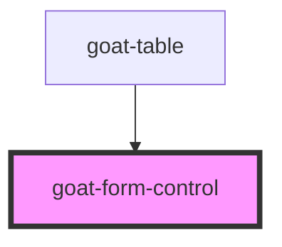

# goat-field-group

<!-- Auto Generated Below -->

## Properties

| Property   | Attribute  | Description                           | Type      | Default     |
| ---------- | ---------- | ------------------------------------- | --------- | ----------- |
| `caption`  | `caption`  | The caption for the form control.     | `string`  | `undefined` |
| `error`    | `error`    |                                       | `string`  | `undefined` |
| `inline`   | `inline`   |                                       | `boolean` | `false`     |
| `label`    | `label`    | The label for the form control.       | `string`  | `undefined` |
| `required` | `required` | Whether the form control is required. | `boolean` | `false`     |
| `success`  | `success`  |                                       | `string`  | `undefined` |
| `warning`  | `warning`  |                                       | `string`  | `undefined` |

## Dependencies

### Used by

 - [goat-table](../../table/table)

### Graph

----------------------------------------------

*Built with love!*
