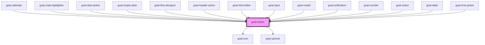

# goat-button

<!-- Auto Generated Below -->

## Properties

| Property         | Attribute         | Description                                                                                                                                                                                              | Type                                                                                                                          | Default     |
| ---------------- | ----------------- | -------------------------------------------------------------------------------------------------------------------------------------------------------------------------------------------------------- | ----------------------------------------------------------------------------------------------------------------------------- | ----------- |
| `color`          | `color`           |                                                                                                                                                                                                          | `"brand-primary" \| "brand-secondary" \| "danger" \| "dark" \| "inverse" \| "light" \| "primary" \| "secondary" \| "success"` | `'primary'` |
| `configAria`     | `config-aria`     |                                                                                                                                                                                                          | `any`                                                                                                                         | `{}`        |
| `disabled`       | `disabled`        | If true, the user cannot interact with the button. Defaults to `false`.                                                                                                                                  | `boolean`                                                                                                                     | `false`     |
| `disabledReason` | `disabled-reason` |                                                                                                                                                                                                          | `string`                                                                                                                      | `''`        |
| `href`           | `href`            | Hyperlink to navigate to on click.                                                                                                                                                                       | `string`                                                                                                                      | `undefined` |
| `icon`           | `icon`            | Icon which will displayed on button. Possible values are icon names.                                                                                                                                     | `string`                                                                                                                      | `undefined` |
| `iconAlign`      | `icon-align`      | Icon position.                                                                                                                                                                                           | `"end" \| "start"`                                                                                                            | `'end'`     |
| `iconSize`       | `icon-size`       | Icon size.                                                                                                                                                                                               | `string`                                                                                                                      | `'md'`      |
| `kind`           | `kind`            | Button kind. Possible values are `"default"`, `"simple"`, `"block"`. Defaults to `"default"`. `"default"` is a long button. `"simple"` is a text-only button. `"block"` is a full-width button.          | `"block" \| "default" \| "simple"`                                                                                            | `'default'` |
| `selected`       | `selected`        | Button selection state.                                                                                                                                                                                  | `boolean`                                                                                                                     | `false`     |
| `showLoader`     | `show-loader`     | Show loader.                                                                                                                                                                                             | `boolean`                                                                                                                     | `false`     |
| `size`           | `size`            | Button size. Possible values are `"sm"`, `"md"`, `"lg"`, `"xl"`, `"2xl"`, `"full"`. Defaults to `"md"`.                                                                                                  | `"2xl" \| "full" \| "lg" \| "md" \| "sm" \| "xl"`                                                                             | `'md'`      |
| `target`         | `target`          | Sets or retrieves the window or frame at which to target content.                                                                                                                                        | `string`                                                                                                                      | `'_self'`   |
| `type`           | `type`            |                                                                                                                                                                                                          | `"button" \| "reset" \| "submit"`                                                                                             | `'button'`  |
| `variant`        | `variant`         | Button variants. Possible values are `"default"`, `"outline"`, `"ghost"`. Defaults to `"default"`. `"default"` is a filled button. `"outline"` is an outlined button. `"ghost"` is a transparent button. | `"default" \| "ghost" \| "light" \| "link" \| "outline"`                                                                      | `'default'` |

## Events

| Event        | Description                                                       | Type               |
| ------------ | ----------------------------------------------------------------- | ------------------ |
| `goat:click` | On click of button, a CustomEvent 'goat:click' will be triggered. | `CustomEvent<any>` |

## Methods

### `setBlur() => Promise<void>`

Sets blur on the native `button` in `goat-button`. Use this method instead of the global
`button.blur()`.

#### Returns

Type: `Promise<void>`

### `setFocus() => Promise<void>`

Sets focus on the native `button` in `goat-button`. Use this method instead of the global
`button.focus()`.

#### Returns

Type: `Promise<void>`

### `triggerClick() => Promise<void>`

#### Returns

Type: `Promise<void>`

## Dependencies

### Used by

 - [goat-calendar](../../calendar/calendar)
 - [goat-code-highlighter](../../data-display/code-highlighter)
 - [goat-date-picker](../../data-entry/date/date-picker)
 - [goat-empty-state](../../data-display/empty-state)
 - [goat-flow-designer](../../flow-designer/flow-designer)
 - [goat-header-action](../../navigation/header/header-action)
 - [goat-html-editor](../../data-entry/html-editor)
 - [goat-input](../../data-entry/input/input)
 - [goat-modal](../../modal/modal)
 - [goat-notification](../../feedback/notification)
 - [goat-number](../../data-entry/input/number)
 - [goat-select](../../data-entry/select)
 - [goat-table](../../data-display/table)
 - [goat-time-picker](../../data-entry/date/time-picker)

### Depends on

- [goat-icon](../icon)
- [goat-spinner](../../feedback/spinner)

### Graph

----------------------------------------------

*Built with love!*
