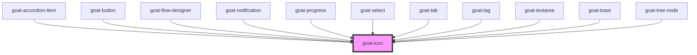

# goat-icon

<!-- Auto Generated Below -->

## Properties

| Property | Attribute | Description    | Type     | Default     |
| -------- | --------- | -------------- | -------- | ----------- |
| `name`   | `name`    |                | `string` | `undefined` |
| `size`   | `size`    | The Icon size. | `string` | `undefined` |

## Dependencies

### Used by

 - [goat-accordion-item](../accordion/accordion-item)
 - [goat-button](../button)
 - [goat-flow-designer](../flow-designer/flow-designer)
 - [goat-notification](../notification)
 - [goat-progress](../progress)
 - [goat-select](../data-entry/select)
 - [goat-tab](../tabs/tab)
 - [goat-tag](../data-display/tag)
 - [goat-textarea](../data-entry/input/textarea)
 - [goat-toast](../toast)
 - [goat-tree-node](../tree-view/tree-node)

### Graph

----------------------------------------------

*Built with love!*
