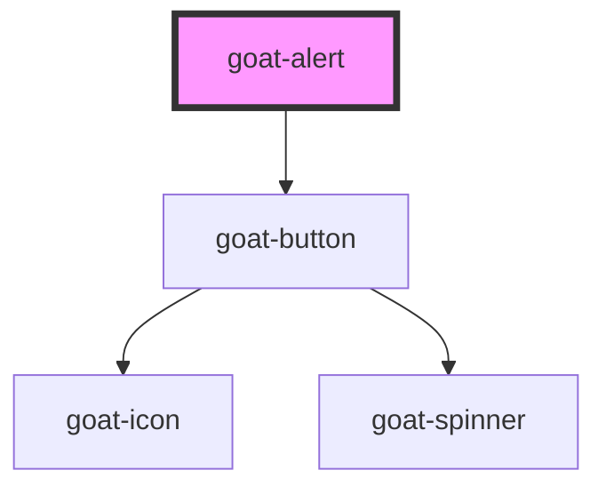

# goat-alert

<!-- Auto Generated Below -->

## Properties

| Property      | Attribute     | Description | Type                                          | Default  |
| ------------- | ------------- | ----------- | --------------------------------------------- | -------- |
| `description` | `description` |             | `string`                                      | `''`     |
| `dismissible` | `dismissible` |             | `boolean`                                     | `false`  |
| `message`     | `message`     |             | `string`                                      | `''`     |
| `state`       | `state`       |             | `"error" \| "info" \| "success" \| "warning"` | `'info'` |

## Events

| Event          | Description | Type               |
| -------------- | ----------- | ------------------ |
| `goat:dismiss` |             | `CustomEvent<any>` |

## Dependencies

### Depends on

- [goat-button](../../input-controls/button)

### Graph

----------------------------------------------

*Built with love!*
