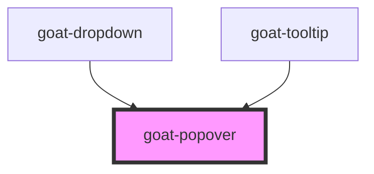

# goat-dropdown

<!-- Auto Generated Below -->

## Properties

| Property         | Attribute         | Description                                                                                                                                                                                                                                                                                                                                                                                                                                                                                                                                                                                                                                                                                                                                                                                                                                                                                                                                                                                                                                                                                                                   | Type                             | Default     |
| ---------------- | ----------------- | ----------------------------------------------------------------------------------------------------------------------------------------------------------------------------------------------------------------------------------------------------------------------------------------------------------------------------------------------------------------------------------------------------------------------------------------------------------------------------------------------------------------------------------------------------------------------------------------------------------------------------------------------------------------------------------------------------------------------------------------------------------------------------------------------------------------------------------------------------------------------------------------------------------------------------------------------------------------------------------------------------------------------------------------------------------------------------------------------------------------------------- | -------------------------------- | ----------- |
| `dismissTimeout` | `dismiss-timeout` | Time in milliseconds to wait before hiding the popover when the trigger is set to `"hover"`.                                                                                                                                                                                                                                                                                                                                                                                                                                                                                                                                                                                                                                                                                                                                                                                                                                                                                                                                                                                                                                  | `number`                         | `300`       |
| `offset`         | `offset`          | The offset of the popover relative to the trigger element. This value is used to adjust the position of the popover along the axis of the trigger element.                                                                                                                                                                                                                                                                                                                                                                                                                                                                                                                                                                                                                                                                                                                                                                                                                                                                                                                                                                    | `number`                         | `4`         |
| `open`           | `open`            | Controls the visibility of the popover when the `trigger` property is set to `"manual"`. When `true`, the popover is visible. When `false`, the popover is hidden.                                                                                                                                                                                                                                                                                                                                                                                                                                                                                                                                                                                                                                                                                                                                                                                                                                                                                                                                                            | `boolean`                        | `false`     |
| `placements`     | `placements`      | The placement of the popover relative to the trigger element. Possible values are: - `"top"`: The popover is placed above the trigger element. - `"top-start"`: The popover is placed above the trigger element, aligned to the start. - `"top-end"`: The popover is placed above the trigger element, aligned to the end. - `"right"`: The popover is placed to the right of the trigger element. - `"right-start"`: The popover is placed to the right of the trigger element, aligned to the start. - `"right-end"`: The popover is placed to the right of the trigger element, aligned to the end. - `"bottom"`: The popover is placed below the trigger element. - `"bottom-start"`: The popover is placed below the trigger element, aligned to the start. - `"bottom-end"`: The popover is placed below the trigger element, aligned to the end. - `"left"`: The popover is placed to the left of the trigger element. - `"left-start"`: The popover is placed to the left of the trigger element, aligned to the start. - `"left-end"`: The popover is placed to the left of the trigger element, aligned to the end. | `string`                         | `undefined` |
| `timeout`        | `timeout`         | Time in milliseconds to wait before showing the popover when the trigger is set to `"hover"`.                                                                                                                                                                                                                                                                                                                                                                                                                                                                                                                                                                                                                                                                                                                                                                                                                                                                                                                                                                                                                                 | `number`                         | `300`       |
| `tip`            | `tip`             | The tip of the popover. Possible values are: - `"caret"`: A triangle tip. - `"tab"`: A tab tip. - `"none"`: No tip.                                                                                                                                                                                                                                                                                                                                                                                                                                                                                                                                                                                                                                                                                                                                                                                                                                                                                                                                                                                                           | `"caret" \| "none" \| "tab"`     | `'caret'`   |
| `trigger`        | `trigger`         | Determines how the popover is triggered. Possible values are: - `"click"`: The popover is shown or hidden when the trigger element is clicked. - `"hover"`: The popover is shown when the mouse hovers over the trigger element and hidden when it leaves. - `"manual"`: The visibility of the popover must be manually controlled through the `open` property.                                                                                                                                                                                                                                                                                                                                                                                                                                                                                                                                                                                                                                                                                                                                                               | `"click" \| "hover" \| "manual"` | `'hover'`   |

## Events

| Event                 | Description                         | Type               |
| --------------------- | ----------------------------------- | ------------------ |
| `goat-popover--close` | Emitted when the popover is closed. | `CustomEvent<any>` |
| `goat-popover--open`  | Emitted when the popover is opened. | `CustomEvent<any>` |

## Methods

### `hide() => Promise<void>`

Hides the popover. This method is useful when the trigger is set to `"manual"`.

#### Returns

Type: `Promise<void>`

### `show(target?: HTMLElement) => Promise<void>`

Shows the popover.
This method is particularly useful when the trigger mode is set to `"manual"`.
It allows for programmatic control over the visibility of the popover, making it visible regardless of the trigger mode.
Optionally, a target HTMLElement can be provided to dynamically set the trigger element for the popover.

#### Parameters

| Name     | Type          | Description |
| -------- | ------------- | ----------- |
| `target` | `HTMLElement` |             |

#### Returns

Type: `Promise<void>`

## Dependencies

### Used by

 - [goat-dropdown](../../../navigation/dropdown)
 - [goat-tooltip](../tooltip)

### Graph

----------------------------------------------

*Built with love!*
