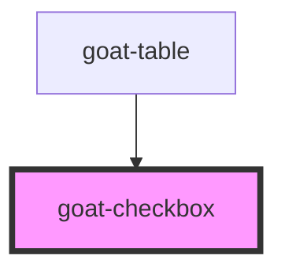

# goat-checkbox

<!-- Auto Generated Below -->

## Properties

| Property       | Attribute      | Description                                                                       | Type                           | Default                    |
| -------------- | -------------- | --------------------------------------------------------------------------------- | ------------------------------ | -------------------------- |
| `configAria`   | `config-aria`  |                                                                                   | `any`                          | `{}`                       |
| `disabled`     | `disabled`     | If true, the user cannot interact with the button. Defaults to `false`.           | `boolean`                      | `false`                    |
| `intermediate` | `intermediate` |                                                                                   | `boolean`                      | `false`                    |
| `label`        | `label`        | The checkbox label.                                                               | `string`                       | `undefined`                |
| `layer`        | `layer`        |                                                                                   | `"01" \| "02" \| "background"` | `undefined`                |
| `name`         | `name`         | The input field name.                                                             | `string`                       | ``goat-input-${this.gid}`` |
| `readonly`     | `readonly`     |                                                                                   | `boolean`                      | `false`                    |
| `required`     | `required`     | If true, required icon is show. Defaults to `false`.                              | `boolean`                      | `false`                    |
| `rounded`      | `rounded`      |                                                                                   | `boolean`                      | `false`                    |
| `size`         | `size`         | The button size. Possible values are: `"sm"`, `"md"`, `"lg"`. Defaults to `"md"`. | `"lg" \| "md" \| "sm"`         | `'md'`                     |
| `value`        | `value`        | The input field value.                                                            | `boolean`                      | `false`                    |

## Events

| Event                   | Description                                                                                                                                   | Type               |
| ----------------------- | --------------------------------------------------------------------------------------------------------------------------------------------- | ------------------ |
| `goat-checkbox--blur`   | Emitted when the input loses focus.                                                                                                           | `CustomEvent<any>` |
| `goat-checkbox--change` | On change of input a CustomEvent 'goat-checkbox--change' will be triggered. Event details contains parent event, oldValue, newValue of input. | `CustomEvent<any>` |
| `goat-checkbox--focus`  | Emitted when the input has focus.                                                                                                             | `CustomEvent<any>` |

## Methods

### `getComponentId() => Promise<string>`

#### Returns

Type: `Promise<string>`

### `setBlur() => Promise<void>`

Sets blur on the native `input` in `goat-input`. Use this method instead of the global
`input.blur()`.

#### Returns

Type: `Promise<void>`

### `setFocus() => Promise<void>`

Sets focus on the native `input` in `goat-input`. Use this method instead of the global
`input.focus()`.

#### Returns

Type: `Promise<void>`

## Dependencies

### Used by

 - [goat-table](../../table)

### Graph

----------------------------------------------

*Built with love!*
