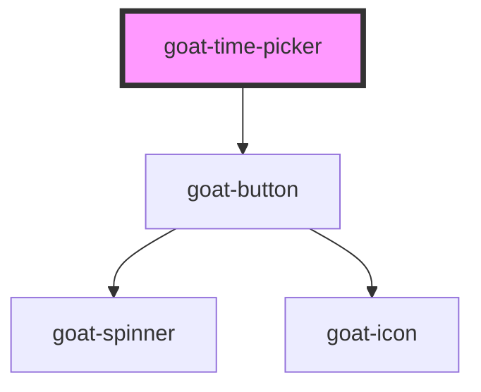

# goat-time-picker

<!-- Auto Generated Below -->

## Properties

| Property      | Attribute     | Description                                                                            | Type                   | Default                    |
| ------------- | ------------- | -------------------------------------------------------------------------------------- | ---------------------- | -------------------------- |
| `configAria`  | `config-aria` |                                                                                        | `any`                  | `{}`                       |
| `disabled`    | `disabled`    | If true, the user cannot interact with the button. Defaults to `false`.                | `boolean`              | `false`                    |
| `inline`      | `inline`      |                                                                                        | `boolean`              | `false`                    |
| `name`        | `name`        | The input field name.                                                                  | `string`               | ``goat-input-${this.gid}`` |
| `placeholder` | `placeholder` | The input field placeholder.                                                           | `string`               | `undefined`                |
| `readonly`    | `readonly`    | If true, the user read the value cannot modify it. Defaults to `false`.                | `boolean`              | `false`                    |
| `size`        | `size`        | The input field size. Possible values are: `"sm"`, `"md"`, `"lg"`. Defaults to `"md"`. | `"lg" \| "md" \| "sm"` | `'md'`                     |
| `value`       | `value`       | The input field value.                                                                 | `number \| string`     | `''`                       |

## Events

| Event         | Description                             | Type               |
| ------------- | --------------------------------------- | ------------------ |
| `goat:blur`   | Emitted when the input loses focus.     | `CustomEvent<any>` |
| `goat:change` | Emitted when the value has changed.     | `CustomEvent<any>` |
| `goat:focus`  | Emitted when the input has focus.       | `CustomEvent<any>` |
| `goat:input`  | Emitted when a keyboard input occurred. | `CustomEvent<any>` |

## Methods

### `getComponentId() => Promise<string>`

#### Returns

Type: `Promise<string>`

### `setBlur() => Promise<void>`

Sets blur on the native `input` in `goat-input`. Use this method instead of the global
`input.blur()`.

#### Returns

Type: `Promise<void>`

### `setFocus() => Promise<void>`

Sets focus on the native `input` in `goat-input`. Use this method instead of the global
`input.focus()`.

#### Returns

Type: `Promise<void>`

## Dependencies

### Depends on

- [goat-button](../../../../primitive/button/button)

### Graph

----------------------------------------------

*Built with love!*
