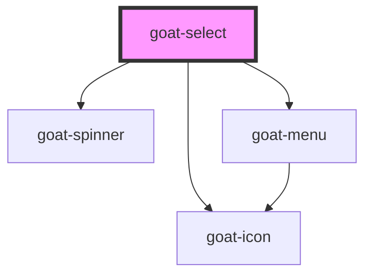

# goat-select

<!-- Auto Generated Below -->

## Properties

| Property      | Attribute     | Description                                                                                           | Type                                                           | Default                                      |
| ------------- | ------------- | ----------------------------------------------------------------------------------------------------- | -------------------------------------------------------------- | -------------------------------------------- |
| `actions`     | --            |                                                                                                       | `any[]`                                                        | `[]`                                         |
| `clearInput`  | `clear-input` | If `true`, a clear icon will appear in the input when there is a value. Clicking it clears the input. | `boolean`                                                      | `false`                                      |
| `config`      | `config`      |                                                                                                       | `any`                                                          | `{ itemValue: 'value', itemLabel: 'label' }` |
| `data`        | `data`        |                                                                                                       | `any`                                                          | `[]`                                         |
| `disabled`    | `disabled`    | If true, the user cannot interact with the button. Defaults to `false`.                               | `boolean`                                                      | `false`                                      |
| `isOpen`      | `is-open`     |                                                                                                       | `boolean`                                                      | `false`                                      |
| `managed`     | `managed`     |                                                                                                       | `boolean`                                                      | `false`                                      |
| `name`        | `name`        | The input field name.                                                                                 | `string`                                                       | ``goat-select-${this.id}``                   |
| `placeholder` | `placeholder` | The input field placeholder.                                                                          | `string`                                                       | `undefined`                                  |
| `position`    | `position`    |                                                                                                       | `"bottom-left" \| "bottom-right" \| "top-left" \| "top-right"` | `'bottom-left'`                              |
| `required`    | `required`    | If true, required icon is show. Defaults to `false`.                                                  | `boolean`                                                      | `false`                                      |
| `showLoader`  | `show-loader` |                                                                                                       | `boolean`                                                      | `false`                                      |
| `size`        | `size`        | The button size. Possible values are: `"sm"`, `"md"`, `"lg"`. Defaults to `"md"`.                     | `"lg" \| "md" \| "sm"`                                         | `'md'`                                       |
| `type`        | `type`        | Select type Possible values are `"select"`, `"typeahead"`. Defaults to `"select"`.                    | `"select" \| "typeahead"`                                      | `'select'`                                   |
| `value`       | `value`       | The input field value.                                                                                | `number \| string`                                             | `undefined`                                  |

## Events

| Event               | Description                                 | Type               |
| ------------------- | ------------------------------------------- | ------------------ |
| `goat:action-click` | Emitted when the action button is clicked.. | `CustomEvent<any>` |
| `goat:change`       | Emitted when the value has changed..        | `CustomEvent<any>` |
| `goat:input`        | Emitted when a keyboard input occurred.     | `CustomEvent<any>` |

## Methods

### `setFocus() => Promise<void>`

Sets focus on the native `input` in `ion-input`. Use this method instead of the global
`input.focus()`.

#### Returns

Type: `Promise<void>`

## Dependencies

### Depends on

- [goat-icon](../../content/icon)
- [goat-spinner](../../informational/spinner)
- [goat-menu](../../pickers/menu)

### Graph

----------------------------------------------

*Built with love!*
