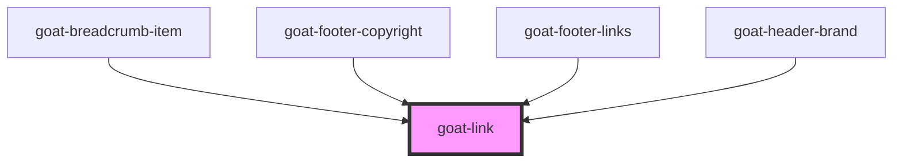

# goat-button

<!-- Auto Generated Below -->

## Properties

| Property | Attribute | Description                                                       | Type     | Default     |
| -------- | --------- | ----------------------------------------------------------------- | -------- | ----------- |
| `href`   | `href`    | Hyperlink to navigate to on click.                                | `string` | `undefined` |
| `target` | `target`  | Sets or retrieves the window or frame at which to target content. | `string` | `undefined` |

## Methods

### `triggerClick() => Promise<void>`

#### Returns

Type: `Promise<void>`

## Dependencies

### Used by

 - [goat-breadcrumb-item](../navigation/breadcrumb/breadcrumb-item)
 - [goat-footer-copyright](../application/footer/footer-copyright)
 - [goat-footer-links](../application/footer/footer-links)
 - [goat-header-brand](../application/header/header-brand)

### Graph

----------------------------------------------

*Built with love!*
