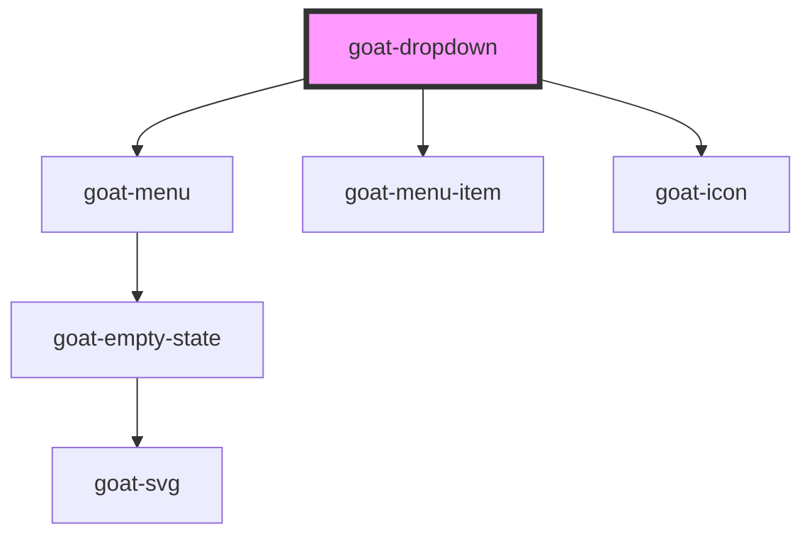

# goat-dropdown

<!-- Auto Generated Below -->

## Properties

| Property    | Attribute   | Description                                                                       | Type                   | Default                                         |
| ----------- | ----------- | --------------------------------------------------------------------------------- | ---------------------- | ----------------------------------------------- |
| `disabled`  | `disabled`  | If true, the user cannot interact with the button. Defaults to `false`.           | `boolean`              | `false`                                         |
| `isOpen`    | `is-open`   |                                                                                   | `boolean`              | `false`                                         |
| `items`     | --          |                                                                                   | `any[]`                | `null`                                          |
| `positions` | `positions` |                                                                                   | `string`               | `'bottom-right,top-right,bottom-left,top-left'` |
| `size`      | `size`      | The button size. Possible values are: `"sm"`, `"md"`, `"lg"`. Defaults to `"md"`. | `"lg" \| "md" \| "sm"` | `'md'`                                          |

## Methods

### `setFocus(elm?: HTMLElement) => Promise<void>`

#### Returns

Type: `Promise<void>`

## Dependencies

### Depends on

- [goat-menu](../menu)
- [goat-menu-item](../menu-item)
- [goat-icon](../../content/icon)

### Graph

----------------------------------------------

*Built with love!*
