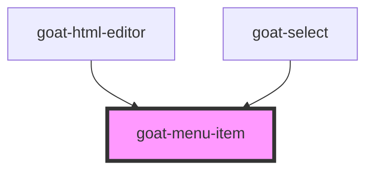

# goat-menu-item

<!-- Auto Generated Below -->

## Properties

| Property   | Attribute  | Description                                                             | Type                           | Default     |
| ---------- | ---------- | ----------------------------------------------------------------------- | ------------------------------ | ----------- |
| `disabled` | `disabled` | If true, the user cannot interact with the button. Defaults to `false`. | `boolean`                      | `false`     |
| `href`     | `href`     | Hyperlink to navigate to on click.                                      | `string`                       | `undefined` |
| `layer`    | `layer`    |                                                                         | `"01" \| "02" \| "background"` | `undefined` |
| `selected` | `selected` | Menu item selection state.                                              | `boolean`                      | `false`     |
| `target`   | `target`   | Sets or retrieves the window or frame at which to target content.       | `string`                       | `'_self'`   |
| `value`    | `value`    | The menu item value.                                                    | `number \| string`             | `undefined` |

## Events

| Event                  | Description                            | Type               |
| ---------------------- | -------------------------------------- | ------------------ |
| `goat:menu-item-click` | Emitted when the menu item is clicked. | `CustomEvent<any>` |

## Methods

### `setBlur() => Promise<void>`

Sets blur on the native `input` in `goat-input`. Use this method instead of the global
`input.blur()`.

#### Returns

Type: `Promise<void>`

### `setFocus() => Promise<void>`

Sets focus on the native `input` in `goat-input`. Use this method instead of the global
`input.focus()`.

#### Returns

Type: `Promise<void>`

## Dependencies

### Used by

 - [goat-html-editor](../../data-entry/html-editor)
 - [goat-select](../../data-entry/select)

### Graph

----------------------------------------------

*Built with love!*
