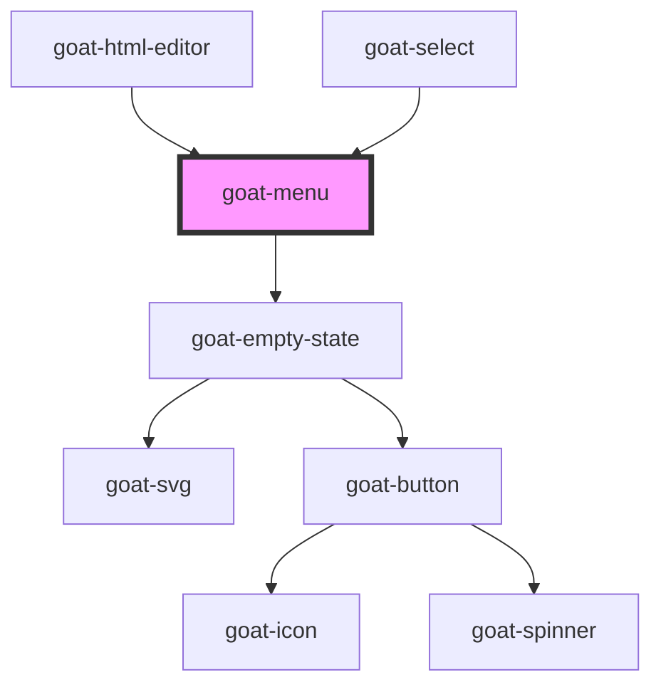

# goat-menu

<!-- Auto Generated Below -->

## Properties

| Property                | Attribute                 | Description                                                                          | Type                           | Default                           |
| ----------------------- | ------------------------- | ------------------------------------------------------------------------------------ | ------------------------------ | --------------------------------- |
| `empty`                 | `empty`                   |                                                                                      | `boolean`                      | `false`                           |
| `emptyStateDescription` | `empty-state-description` |                                                                                      | `string`                       | `'There are no items to display'` |
| `emptyStateHeadline`    | `empty-state-headline`    |                                                                                      | `string`                       | `'No items'`                      |
| `layer`                 | `layer`                   |                                                                                      | `"01" \| "02" \| "background"` | `undefined`                       |
| `showLoader`            | `show-loader`             |                                                                                      | `boolean`                      | `false`                           |
| `size`                  | `size`                    | The menu item size. Possible values are: `"sm"`, `"md"`, `"lg"`. Defaults to `"md"`. | `"lg" \| "md" \| "sm"`         | `'md'`                            |
| `value`                 | `value`                   |                                                                                      | `number \| string`             | `undefined`                       |

## Methods

### `setFocus() => Promise<void>`

Sets focus on first menu item. Use this method instead of the global
`element.focus()`.

#### Returns

Type: `Promise<void>`

## Dependencies

### Used by

 - [goat-html-editor](../../data-entry/html-editor)
 - [goat-select](../../data-entry/select)

### Depends on

- [goat-empty-state](../../empty-state)

### Graph

----------------------------------------------

*Built with love!*
