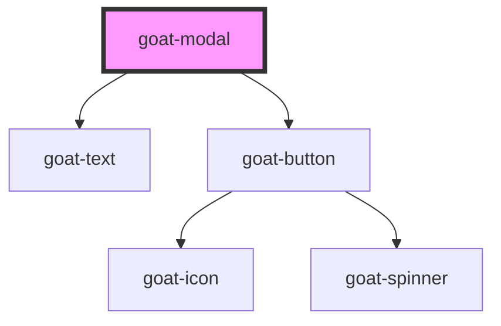

# p4-modal

<!-- Auto Generated Below -->

## Properties

| Property | Attribute | Description | Type      | Default |
| -------- | --------- | ----------- | --------- | ------- |
| `show`   | `show`    |             | `boolean` | `false` |

## Dependencies

### Depends on

- [goat-text](../../text)
- [goat-button](../../button)

### Graph

----------------------------------------------

*Built with love!*
