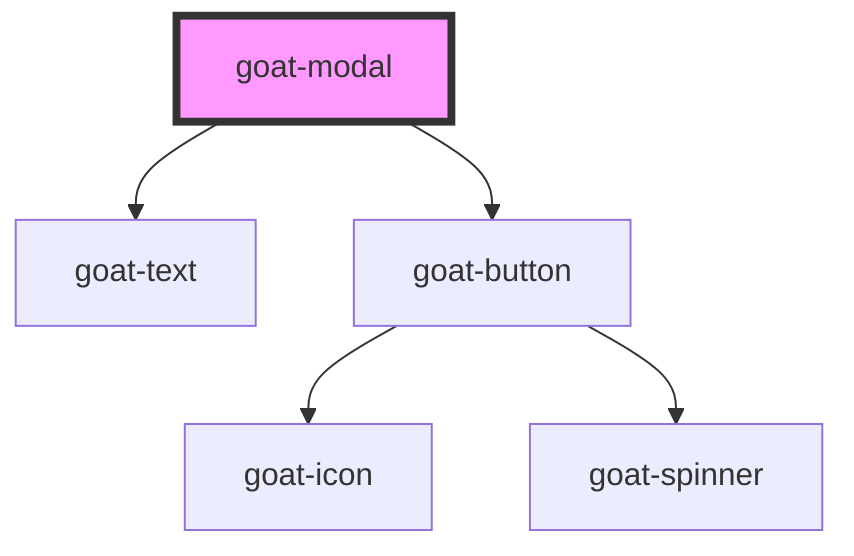

# p4-modal

<!-- Auto Generated Below -->

## Properties

| Property     | Attribute    | Description | Type      | Default     |
| ------------ | ------------ | ----------- | --------- | ----------- |
| `heading`    | `heading`    |             | `string`  | `undefined` |
| `hideClose`  | `hide-close` |             | `boolean` | `false`     |
| `open`       | `open`       |             | `boolean` | `false`     |
| `subheading` | `subheading` |             | `string`  | `undefined` |

## Events

| Event              | Description                                                             | Type               |
| ------------------ | ----------------------------------------------------------------------- | ------------------ |
| `goat:modal-close` | On click of button, a CustomEvent 'goat:modal-close' will be triggered. | `CustomEvent<any>` |

## Dependencies

### Depends on

- [goat-text](../../text)
- [goat-button](../../button)

### Graph

----------------------------------------------

*Built with love!*
